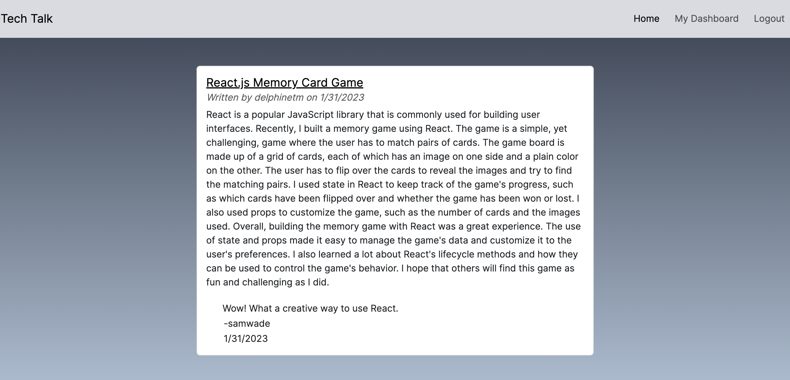

# Tech Talk
 

## Description
This is a full-stack application created so that developers have a space to share their technical and creative writing about development, new advancements and favorite technologies. Users can write, update and delete blog posts, as well as read other developers post and leave comments about their work. This application uses Node.js, Express.js, Sequelize, sessions, and Handlebars.

## Table of Contents
- [Installation](#installation)
- [Usage](#usage)
- [Credits](#credits)
- [License](#license)
- [Contributing](#contributing)
- [Tests](#tests)
- [Questions](#questions)

## Installation
To install the project, download Node.js then install the necessary node package managers by running npm i. Finally, create the database in a SQL workbench, seed the data, spin up the server and check out the application.

## Usage
The user is greeted by the homepage filled with blog posts by various developers. Further utilization of the application requires signing up or logging in, which can be done on the Login page. After logging in, the user can create their own blog post, update an existing blog post, or delete a blog post. From the homepage, the user can then click on the title of the blog post and leave a comment.

## Credits
Collaborators: Amaryah Wolf

## License
This application is covered under the MIT license.

## Contributing
[Contributor Covenant](https://www.contributor-covenant.org/version/2/1/code_of_conduct/)

## Tests
N/A

## Questions
For additional questions, find me on [github](https://github.com/amaryahwolf) or email me at amaryahwolf@gmail.com.